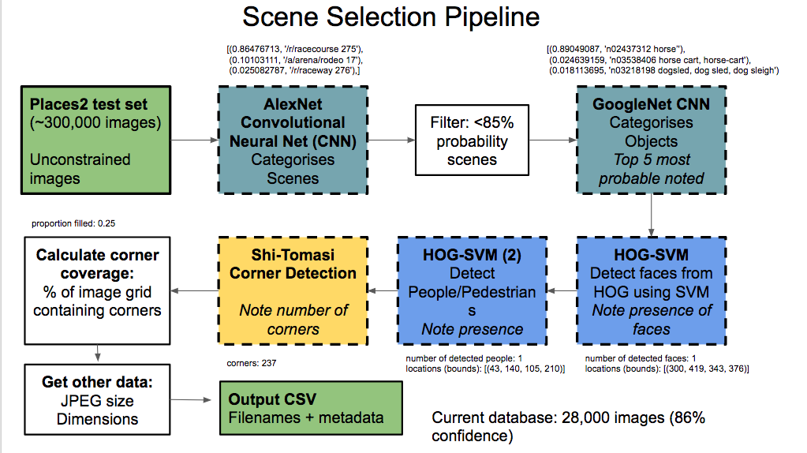

# Scene_class
Caffe/OpenCV pipeline for classifying and describing scenes for cognitive research. 

I made this as a work project to get some sensible images for a visual search-type experiment.

You can see how it works in the 'Scene_class.ipynb' notebook. All paths are absolute to my local machine at this point, and you will probably have to work to get all dependencies running - I used Ubuntu 16.04 as my OS. 

# Requirements
- OpenCV3 (and dependencies)
- Python2.7 (I used Anaconda)
- Jupyter
- Caffe (and dependencies)
  - pycaffe

# Stimuli
These are downloaded from the Places2 database, I have used the test set, but you can use anything really. 
- run: 'sh get_places2_test.sh'  to get the ~20 Gb dataset.

